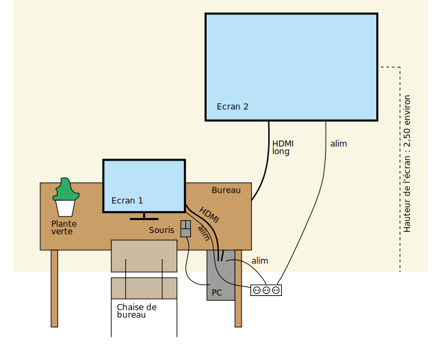

# viceorganique  
https://github.com/randomDam/viceorganique

Vi(c)e organique / BIP Liège
Fiche technique

Liste matériel
- 1 PC avec bon processeur (Système d’exploitation 64 bits) avec possibilité de connecter les 2 écrans
- 1 écran de bureau (environ 24 pouces)
- 1 grand écran (environ 46 pouces)
- 1 souris
- 1 câble hdmi (ou vga, en fonction du PC et de l’écran de bureau) de 3m environ (pour relier l’écran sur
le bureau au PC)
- 1 câble hdmi (ou vga, en fonction du PC et du grand écran) de 7-10m environ (pour relier l’écran fixé en
hauteur au PC)
- 1 câble alimentation pour le PC (2 ou 3m)
- 1 câble alimentation pour l’écran de bureau (2 ou 3m)
- 1 câble alimentation pour l’écran fixé en hauteur (7-10m environ)
- 3 arrivées électriques
- 1 chaise de bureau
- 1 plante verte de bureau
(- 1 clavier : non présent dans l’installation mais utile pour le lancement du programme)

---
---

# Dispositif

## Installations préalables (à faire qu’une seule fois, lors du montage)
### Logiciels prérequis

- Installer node.js (le fichier d’installation sera joint)  
__pour info : le dossier par default est :__  
C:\Program Files\nodejs\

- Installer les navigateurs Chrome et Chromium (les fichiers d’installation seront joints)  :

#### Chromium :
https://download-chromium.appspot.com/  
Deziper le fichier et le déplacer dans  
C:\Program Files\
de sorte a ce que :  
C:\Program Files\chrome-win\chrome.exe soit accessible.

#### Chrome :
https://www.google.com/intl/fr_fr/chrome/  
de sorte a ce que :  
C:\Program Files (x86)\Google\Chrome\Application\chrome.exe

### Démarrage automatique du dispositif :  
- Télécharger completement se dossier.
- Dézipper dans un dossier

Le fichier autoStart.bat détermine la séquence d'éléments a 
démarrer pour que le dispositif soit prêt a être utilisé.

- appuyer sur la touche : WINDOWS+R et taper "shell:startup"  
- une fenêtre s'ouvre, il s'agit du dossier ou windows démarrera automatiquement 
les applications
- sur le fichier autostart.bat > boutton droit > copier
- dans la fenetre précédemment ouverte > boutton droit > coller le raccourcis.

Normalement le dispositif devrait se lancer automatiquement a chaque démarrage de l'ordinateur.
[vous pouvez tester en double cliquant sur autoStart.bat]

De plus pour un démarrage completement automatique au niveau de windows :
https://www.passfab.fr/windows/automatically-log-in-to-windows.html#p2  
[La solution 1 marche très bien]
